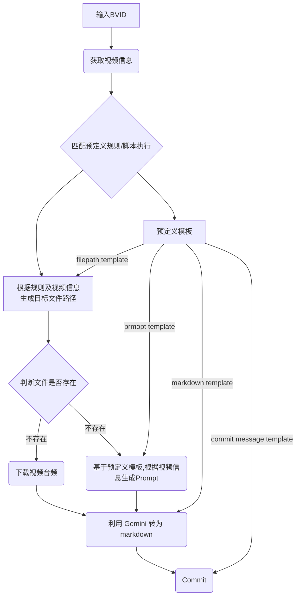

# auto-doc-template

这是一个模版仓库

该仓库通过配置规则，利用GitHub Action 以及 Gemini API 自动将符合要求的B站视频转为markdown 并提交至仓库。

结合 SSG 将 markdown 进行展示。本仓库中使用 [fumadocs](https://github.com/fuma-nama/fumadocs)。


## How It Works

通过 GiHub Action 实现的自动化。 其核心流程依赖于预定义的模版规则，具体如下。



## 使用

通过该仓库生成模板后，修改 `.autodoc` 下的文件即可进行规则配置。
其中包含`.autodoc/rules`和`.autodoc/scripts` 两个文件夹。
rules 文件利用yaml 进行定义，匹配`.autodoc/rules`中的所有`*.rule.{yml,yaml}`文件。
scripts 则包含这个过程中可能用到的 JS 脚本。

规则分为两类。`listen` 规则与 `match` 规则。这

### listen 规则
顾名思义，`listen` 规则就是用来监测用户投稿的。利用 GitHub Action的 schedule 触发。
规则中主要指明监测的所需的信息。

以typescript 进行描述，如下

```ts
type ListenRule = LisenRuleItem[]
type LisenRuleItem = { id?: string, platform: Record<string, PlatformRule> }

type BilibiliPlatformRule = {
  post?: PostRule // 用户最新投稿，
  collection?: CollectionRule // not implemented
  series?: SeriesRule // not implemented
  season?: SeasonRule // not implemented
}

// https://socialsisteryi.github.io/bilibili-API-collect/docs/video/collection.html#根据关键词查找视频
// see also https://github.com/SocialSisterYi/bilibili-API-collect/blob/2e203db62eb69e171e32b0e1e7197e47ee078ff8/docs/video/collection.md?plain=1#L1567
// 该接口对应根据关键词查找用户视频。
type PostRule = {
  mid: string // 哔哩哔哩 Member Id
  keywords?: string // 筛选关健词
  script?: string // 在调用该接口后会执行该脚本，可以根据查询信息生成模版取代预定义的模板，适合生成filepath。
  // 根据查询结果生成的 filepath，比 script 结果的优先级要低
  // 用于判断文件是否已存在，从而决定要不要进行下一步。
  filepath?: string
}
```

YAML 格式如下

```yaml
listen:
  - id: Koala聊开源
    platform:
      bilibili:
        post:
          mid: 489667127
          keywords: 科技周报
          filepath: docs/Koala聊开源/{{title}}.md
```

每当 schedule 执行时，会扫描规则文件夹中的所有`listen`规则。每个执行一遍。

### match 规则
match 规则是该流程的核心。

在获取到视频信息后，根据视频信息的内容，匹配到一个特定的规则。 该规则中包含了预定义的模版。

因此 match 规则主要分为两部分，`match` 和 `template`。

#### 匹配部分

具体来说，match 部分利用键值对表示单个匹配条件，利用 `and` | `or` 进行条件组合，可以覆盖大部分场景。
除了利用`yaml`格式的匹配规则之外，同样支持 js 脚本（具体请看下文 script 部分），以实现更灵活的 template 生成规则。
用 typescript 表示如下：
```ts
type MatchRule = LisenRuleItem[]
type LisenRuleItem = { id?: string, platform: Record<string, PlatformMatchRule> }

type BilibiliPlatformMatchRule = {
  script?: string // js 脚本路径
  condition?: Condition,
  template: Template
}
// key value pair
type VideoConditionInfo = Record<string, any>
type Condition<T extends VideoConditionInfo = VideoConditionInfo> = {
  and?: Condition<T>
  or?: Condition<T>
} & T
```

例如下面的匹配规则，就是`owner.mid == 489667127 && /(HackNew\s|科技)周报/.test(title)`

```yaml
match:
  - id: Koala聊开源-科技周报
    platform:
      bilibili:
        script: .autodoc/scripts/bilibili/{{owner.name}}.mjs
        condition: # and
          owner.mid: 489667127
          # 直到写 Readme 的时候，才发现 or 规则的设置有点问题，没考虑到这种情况下的Yaml重名Key
          or:                     # wrong
            title: "科技周报"      # wrong
            title: "HackNews 周报" # wrong
          # 好在值实际上表示的是一个正则表达式（new Regexp)
          # 这种问题写法可以转为正则表达式
          title: (HackNews\s|科技)周报
        template: # template info
```

#### Template 部分
template 是生成各类信息的模板，使用时利用当前信息对模板进行插值，从而达到更高的灵活性。

目前包括以下五类：
1. `filepath-template`，最终生成的markdown文件路径模板，可以利用视频信息进行插值。
2. `prompt-template`，音频识别的 prompt模板，可以利用视频信息进行插值，如标题，介绍，相关动态，置顶评论等，有助于提高结果准确度。
3. `system-prompt-template`，同 2.
4. `markdown-template`，最终生成的markdown模板，可以利用视频信息以及 llm 识别之后的信息（如markdown, tag)进行插值。
5. `commit-message-template`，提交信息模板，无关紧要。

##### fallback
在单个 match / listen 规则之外，可以定义一个 fallback template。
当规则没有将所有5个模板字段全部设置时，会应用fallback template 填充空模板。
例如：
```yaml
fallback:
  filepath: docs/{{owner.name}}/{{title}}.md
  prompt:
    system: |
      这是一段标题为【{{title}}】的视频音频，请识别对应的语言，并转换为对应文本。进行合适的分段。
    user: 这是一段文本。
  markdown: |
    ---
    title: "{{ video.title }}"
    description: "{{ video.desc }}"
    tags: []
    date: {{ video.pubdate }}
    bvid: {{ video.bvid }}
    ---
    {{ai.markdown}}
  commit-message: |
    new docs: {{ title }}
```

## 脚本
在 listen 和 script 规则中，可以使用脚本实现复杂的匹配和模板。
因此预期脚本中会返回两种函数，`listen` 和 `template`。
两种函数都接受视频信息，然后返回模板。

`listen`只在监测用户投稿时使用，一定会执行一遍，适合复杂情况下生成文件路径。
`template` 则是在主要流程中使用，当对应的条件匹配时会生成template。

```typescript
import {Template} from "./type";

type Template = {
  filepath?: string
  prompt?: { system?: string, user?: string }
  markdown?: string
  "commit-message"?: string
}
type VideoInfo = any
type ListenFunction = (data: VideoInfo) => {
  filepath: string,
  template?: Omit<Template, 'filepath'>
}

type TemplateFunction = (data: VideoInfo) => Template

type Script = {
  listen?: ListenFunction
  template?: TemplateFunction
}
```

## 自定义

这是一个模板仓库，因此说明各个 action 的用意有利于对流程进行修改定制。

.github 文件夹下共有 7 个 action，和 5 个 workflow ，以下一一说明。

```

 ├──actions                                                                                                                                                              
 │  ├──bili-download-audio  # 下载哔哩哔哩音频流
 │  ├──bili-fetch           # （Core）主体流程，工作流直接依赖                                                                                                                            
 │  ├──format               #（工具）对模版进行插值，对应 packages/actions/format                                                                                                                                                     
 │  ├──pr-or-commit         #（工具）用于直接提交/创建 PR                                                                                                                                             
 │  ├──stt                  # STT，将音频流转为markdown 
 │  ├──template-loader      # 规则匹配，输出模板，对应 packages/actions/template-loader                                                                                             
 │  └──watch-action         # 执行监测规则的action，对应 packages/actions/watch-action                                                                                                                                   
 └──workflows                                                                                                                                                            
    ├──bili-batch.yml       # (批量) 获取的工作流，分成四个顺序jobs(bili-fetch)，Job内并行（方便避免 llm 的Rate limit）
    │                       # 会创建 batch 分支并提交，但不会创建 PR                                                                                                                                         
    ├──bili.yml             # (手动) 输入单个 BVID 触发 bili-fetch，创建 PR                                                                                                                                       
    ├──ci.yml               # 目前仅测试 template-loader-action                                                                                                                                             
    ├──vercel.yml           # fumadocs 部署到 Vercel                                                                                                                                             
    └──watch.yml            # (自动) 执行监测规则的工作流
```